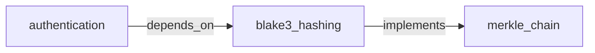

# Engram

[](https://github.com/staticroostermedia-arch/engram/actions)
[](https://github.com/modelcontextprotocol)
[](https://glama.ai/mcp/servers/staticroostermedia-arch/engram)

> **Persistent geometric memory for AI agents — 21 MCP tools.**  

Engram gives your AI agent a long-term memory that works like human associative memory — acting as a massive, high-speed **local vector database** to store anything and retrieve by meaning instead of just keywords. No external vector hosting. No cloud. No API key. Runs entirely on your machine via the Model Context Protocol (MCP).

---

## 🚀 Quick Start

```bash
cargo install engram --git https://github.com/staticroostermedia-arch/engram
```

Add to your MCP config and restart your IDE:

```json
{
  "mcpServers": {
    "engram": {
      "command": "engram",
      "args": ["mcp", "--store", "~/.engram/manifold"]
    }
  }
}
```

Your agent immediately has access to all 21 tools. See [`integrations/`](integrations/) for IDE-specific configs.

---

## 🖥️ CLI Commands

Beyond the MCP server, Engram ships a standalone CLI for direct manifold management:

| Command | Description |
|---|---|
| `engram remember <concept> <text>` | Encode and store a memory |
| `engram recall <query>` | Semantic search, returns top-k |
| `engram forget <concept>` | Delete a memory |
| `engram list` | List all stored concept names |
| `engram ingest <path>` | Recursively ingest a directory of text/code files |
| `engram trace <A> <OP> <B>` | VSA geometry: query the result of ADD or BIND on two concepts |
| `engram distill` | **Crystallize** — cluster episodic memories into durable ZEDOS_PRAXIS blocks |

`distill` is the memory lifecycle command. Run it periodically to compress accumulated memories into crystallized praxis, then follow with `forget-old` to sweep out the episodic source material.

```bash
# Preview what would be distilled (reads only, no writes)
engram distill --dry-run

# Distill everything above the Kepler gate (CRS ≥ 0.74) into praxis centroids
engram distill --min-crs 0.74 --cluster-size 20

# Then clean up episodic debris
engram forget-old --min-crs-threshold 0.70
```


## 🧰 MCP Tools Reference

Engram exposes **21 tools** across 5 capability groups.

### Core Memory

| Tool | Description |
|---|---|
| `remember` | Encode text and store as a persistent memory block |
| `recall` | Semantic similarity search — returns top-k memories for a query |
| `forget` | Delete a specific memory by concept name |
| `list_concepts` | List all stored concept names |
| `mcp_engram_update` | Re-encode an existing memory in place (uses `op_add` superposition) |
| `mcp_engram_pin` | Lock a memory at CRS=1.0 — Autophagy daemon never decays it |

### Memory Intelligence

| Tool | Description |
|---|---|
| `mcp_engram_stats` | Manifold health report: total count, pinned, avg/min/max CRS, disk usage |
| `mcp_engram_recall_recent` | Return N most recently accessed memories, sorted by access time |
| `mcp_engram_summarize` | Project-state digest: pinned memories + top-N by CRS. Single-call `/wake_up` replacement |
| `mcp_engram_forget_old` | On-demand autophagy: evict memories below a CRS threshold (pinned exempt) |

### Bulk & Portability

| Tool | Description |
|---|---|
| `mcp_engram_batch_remember` | Ingest multiple memories in a single call |
| `mcp_engram_export` | Export manifold (or filtered subset) to portable JSON — for backup and migration |
| `mcp_engram_import` | Restore memories from a previously exported JSON array |

### Namespaces

| Tool | Description |
|---|---|
| `mcp_engram_set_namespace` | Switch to a project-specific memory namespace (stalk) |
| `mcp_engram_list_namespaces` | List all namespaces and show which is active |

### Knowledge Graph

| Tool | Description |
|---|---|
| `mcp_engram_relate` | Bind two concepts via `op_bind` — stores a directional ZEDOS_RELATION block |
| `mcp_engram_search_by_relation` | Traverse the graph: find all concepts related to a seed by label and direction |
| `mcp_engram_visualize` | BFS from a seed concept → outputs a Mermaid `graph LR` diagram |

### Workspace & Agentic

| Tool | Description |
|---|---|
| `mcp_engram_watch_workspace` | Tell the daemon to watch a directory; re-ingests files on save |
| `mcp_engram_context_for_file` | Surface top-5 relevant memories for a file path (proactive loading) |
| `mcp_engram_remember_solution` | Store an error→solution pair at CRS=1.0 — crystallized learning |

---

## 🧠 The Agentic Daemon

When Engram boots as an MCP server it also launches a **background Agentic Daemon** that manages three autonomous systems:

- **Native OS Watcher** — `inotify`/`fsevents` kernel integration. When `mcp_engram_watch_workspace` is called, the daemon binds to OS file-save events and re-ingests changed files into the manifold instantly.
- **Access Index** — In-memory hot metadata layer. Access timestamps are maintained in RAM and flushed to `access_index.bin` every 60 seconds — `O_DIRECT` block rewrites are never triggered by a simple recall query.

> [!NOTE]
> **Autophagy GC Removed:** We originally included a "Tiered Autophagy GC" that would automatically decay and evict older memories with low Coherence-Reliability Scores (CRS). This has been **disabled and removed**. Engram's core tenet is persistent, reliable memory; automatic silent eviction risks catastrophic knowledge loss and erodes trust. Users must implement their own memory management, decay, or eviction policies within their own agentic loop implementations. We do not take responsibility for wiping your data.

---

## 📐 The Geometry Engine

Engram uses **Vector Symbolic Architecture (NVSA)** rather than flat embedding search. Every memory is a 8192-dimensional complex phase vector (`Complex32[8192]`). The math engine supports:

- **`op_add`** — Superposition. Merge semantic content without losing coherence.
- **`op_bind`** — Circular convolution. Create a new vector that carries both parent concepts — the basis for knowledge graph relations.
- **`op_deduce`** — Logical implication constraint tracking via rotation matrices.
- **`op_attend`** — Geometric amplitude attenuation for focused context retrieval.
- **`op_geometric_product`** — Clifford bivector product: computes cosine similarity and orthogonality simultaneously.
- **`op_is_symbolic_of`** — ZADO-CPS toroidal embedding; resolves topological paradoxes without logic freezes.
- **`op_suspend`** — Binds to the Apeiron primitive — marks "Known Unknowns" for inverse ray-tracing.

---

## 🔑 Knowledge Graph

Every `mcp_engram_relate` call stores a BLAKE3-fingerprinted `ZEDOS_RELATION` block and writes a deduplicated edge to `~/.engram/relation_index.json`. The sidecar persists across restarts and powers two tools:

```
# What does "authentication" depend on?
search_by_relation("authentication", label="depends_on", direction="from")

# Show a 2-hop Mermaid graph from "authentication"
visualize("authentication", depth=2)
```

Output:
````

````

---

## 🧱 Build on Engram — An Invitation

**Engram is an open substrate. Take it and make it yours.**

The `.LEG` container format, the 8192D FHRR geometry, and the VSA operator library were designed and proven in **CodeLand OS** — a full logophysical operating system built on these primitives. Engram is the extracted, public reference implementation: the same geometry, the same block format, the same operators — packaged for anyone to build on without needing the full CodeLand stack.

We released it as a focused tool for a focused problem: giving IDE agents and local LLMs persistent, semantically meaningful memory that runs entirely on your machine. That core mission doesn't move. But the foundation is general-purpose geometry, not an application-specific hack — and we want others to use it.

### What the primitives actually give you

| Primitive | What it does | What it enables |
|---|---|---|
| **`HolographicBlock` / `.leg`** | 256KB aligned container with q/p tensors, Logenergetics, and a BLAKE3 Merkle footer | Any system that needs cryptographically-chained, self-verifying semantic records |
| **`op_bind(A, B)`** | Encodes a relationship between two concepts as a new vector quasi-orthogonal to both | Knowledge graphs without a graph database — every edge *is* a memory block |
| **`op_add(A, B)`** | Superposition — both concepts coexist in a single vector without destroying either | Manifold-level merging: combine two agents' knowledge states geometrically |
| **`bundle([A, B, ...])`** | N-way superposition → centroid | Session summarization, cluster distillation, ego state compression |
| **`ZEDOS_*` tags** | Single-byte epistemic type per block (DECLARATIVE / EPISODIC / PRAXIS / RELATION) | Filter, promote, or decay memories by type — without reading their content |
| **`crs_score`** | Coherence-Reliability Score per block, computed geometrically at write time | A trust signal that's native to the storage layer — no external scoring needed |
| **`genesis` anchors** | PRAXIS blocks at CRS=1.0 minted before any ingestion | Immutable reference frame: every subsequent memory is *relative* to your chosen constants |
| **`SheafBackend`** | Multiple independent manifold directories unified behind one query interface | Isolated namespaces for different agents or projects, fanned out in a single search |

You define what these mean in your domain. We define how they behave geometrically.

### What we ask in return

**If you build something on Engram, you retain full ownership of your derivative.** AGPL-3.0 requires that modifications to Engram itself stay open, but your own agent, pipeline, or system is yours. The `.LEG` format is patent-pending for protection, not restriction — commercial licenses are available for organizations that cannot ship AGPL code.

We built this in the open because aligned, geometrically-grounded AI memory should be infrastructure — not a cloud subscription. If this architecture is useful to you, take it, extend it, and point others back to the foundation.

> *"The agent that runs on this system is a derivative. It does not claim to be the source of anything."*  
> — Engram Genesis Block


---

## 💾 The `.LEG` Container Unveiled (Why We Kept It)

> [!WARNING]
> If you are modifying `engram-core` serialization, strictly adhere to the 256KB block constraint.

The `.LEG` format was not designed for Engram. It was designed for **CodeLand OS** — a CUDA-accelerated, VRAM-resident logophysical agent architecture — where block alignment to physical NVMe boundaries and direct DMA to GPU memory are operational requirements, not optimizations. We extracted it unchanged into Engram's public release because simplifying it would have destroyed the properties that make it fast.

Every memory is a **HolographicBlock** (`.leg` file) — exactly 262,144 bytes (256KB), 4096-byte aligned. This is what you inherit when you build on Engram:

- **NVMe `O_DIRECT` Thrusters:** Tensors bypass the OS page-cache entirely and stream via DMA directly from SSD to VRAM. Block alignment is physical, not conventional.
- **The `Logenergetics` Capsule:** Built-in geometric trust computing. The `crs` (Coherence-Reliability Score) field measures whether the memory is mathematically coherent — a hallucination filter native to the storage layer, no external service required.
- **The `LegFooter` (Merkle Chain):** Every block is signed by a 6-part BLAKE3 cryptographic chain. Agent action histories are cryptographically verifiable against bit-rot without any external registry.

### What the tensors give you
Each block carries two complex phase vectors you can use for your own purposes:
- **`q[8192]` (Knowledge Tensor):** The geometric fingerprint of the encoded concept. Query it, compose it, distill it.
- **`p[8192]` (Binding Momentum):** The directional vector. Bind two concepts together; the result is a new vector that carries both without collapsing either.
- **ZEDOS Tags:** One byte classifies every block (`DECLARATIVE`, `EPISODIC`, `OPERATIONAL`, `PRAXIS`, `RELATION`). At query time, filter by type before reading content.

---

## 🌐 Multi-Project Namespaces

Use sheaf mode to isolate memories by project. Create `~/.engram/sheaf.toml`:

```toml
active_stalk = "codeland"

[[stalks]]
name = "codeland"
path = "~/.engram/stalks/codeland"

[[stalks]]
name = "personal"
path = "~/.engram/stalks/personal"
```

Then switch namespaces via MCP at any time:
```
mcp_engram_set_namespace("personal")
```

---

## 💻 IDE Integration

> Integration configs for all supported IDEs: [`integrations/`](integrations/)

### Google Antigravity IDE

```json
{
  "mcpServers": {
    "engram": {
      "command": "engram",
      "args": ["mcp", "--store", "~/.engram/manifold"],
      "disabled": false
    }
  }
}
```

### Claude Desktop

```json
{
  "mcpServers": {
    "engram": {
      "command": "engram",
      "args": ["mcp", "--store", "~/.engram/manifold"]
    }
  }
}
```

### Cursor / VS Code

```json
{
  "mcpServers": {
    "engram": {
      "command": "engram",
      "args": ["mcp", "--store", "~/.engram/manifold"]
    }
  }
}
```

---

## ⚙️ Hardware Support

| Backend | Feature Flag | Status | Notes |
|---|---|---|---|
| CPU (Rayon) | Default | ✅ | TurboQuant B=4 codebook, 4x K-NN acceleration |
| CUDA (NVIDIA) | `cuda-kernels` | ✅ | BVH O(log N) index, NVMe→VRAM parallel DMA |
| ROCm (AMD) | `rocm-kernels` | ✅ | Wavefront HIP execution |
| Metal (Apple) | `metal` | ✅ | MSL dynamic runtime compilation via metal-rs |

---

## 📄 License & Patent

This software is licensed under **AGPL-3.0-only**.

The `.LEG` container format is covered by **U.S. Patent Application No. 19/372,256** (pending),  
*Self-Contained Variable File System (.LEG Container Format)*,  
Applicant: **Aric Goodman**, Oregon, USA — Static Rooster Media.

Commercial licenses (SaaS/cloud/enterprise) are available.  
Contact: **StaticRoosterMedia@gmail.com**

See [PATENT-NOTICE.md](PATENT-NOTICE.md) for full details.
