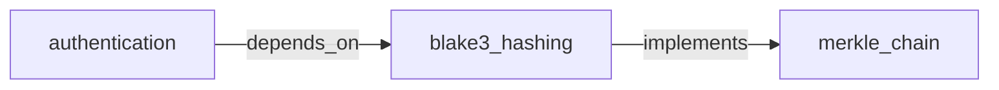

# Engram

[](https://github.com/staticroostermedia-arch/engram/actions)
[](https://github.com/modelcontextprotocol)
[](https://glama.ai/mcp/servers/staticroostermedia-arch/engram)

> **Persistent geometric memory for AI agents — 21 MCP tools.**  
> Patent Pending US19/372,256 — Aric Goodman & Static Rooster Media

Engram gives your AI agent a long-term memory that works like human associative memory — store anything, retrieve by meaning, not keywords. No external vector database. No cloud. No API key. Runs entirely on your machine via the Model Context Protocol (MCP).

---

## 🚀 Quick Start

```bash
cargo install engram --git https://github.com/staticroostermedia-arch/engram
```

Add to your MCP config and restart your IDE:

```json
{
  "mcpServers": {
    "engram": {
      "command": "engram",
      "args": ["mcp", "--store", "~/.engram/manifold"]
    }
  }
}
```

Your agent immediately has access to all 21 tools. See [`integrations/`](integrations/) for IDE-specific configs.

---

## 🧰 MCP Tools Reference

Engram exposes **21 tools** across 5 capability groups.

### Core Memory

| Tool | Description |
|---|---|
| `remember` | Encode text and store as a persistent memory block |
| `recall` | Semantic similarity search — returns top-k memories for a query |
| `forget` | Delete a specific memory by concept name |
| `list_concepts` | List all stored concept names |
| `mcp_engram_update` | Re-encode an existing memory in place (uses `op_add` superposition) |
| `mcp_engram_pin` | Lock a memory at CRS=1.0 — Autophagy daemon never decays it |

### Memory Intelligence

| Tool | Description |
|---|---|
| `mcp_engram_stats` | Manifold health report: total count, pinned, avg/min/max CRS, disk usage |
| `mcp_engram_recall_recent` | Return N most recently accessed memories, sorted by access time |
| `mcp_engram_summarize` | Project-state digest: pinned memories + top-N by CRS. Single-call `/wake_up` replacement |
| `mcp_engram_forget_old` | On-demand autophagy: evict memories below a CRS threshold (pinned exempt) |

### Bulk & Portability

| Tool | Description |
|---|---|
| `mcp_engram_batch_remember` | Ingest multiple memories in a single call |
| `mcp_engram_export` | Export manifold (or filtered subset) to portable JSON — for backup and migration |
| `mcp_engram_import` | Restore memories from a previously exported JSON array |

### Namespaces

| Tool | Description |
|---|---|
| `mcp_engram_set_namespace` | Switch to a project-specific memory namespace (stalk) |
| `mcp_engram_list_namespaces` | List all namespaces and show which is active |

### Knowledge Graph

| Tool | Description |
|---|---|
| `mcp_engram_relate` | Bind two concepts via `op_bind` — stores a directional ZEDOS_RELATION block |
| `mcp_engram_search_by_relation` | Traverse the graph: find all concepts related to a seed by label and direction |
| `mcp_engram_visualize` | BFS from a seed concept → outputs a Mermaid `graph LR` diagram |

### Workspace & Agentic

| Tool | Description |
|---|---|
| `mcp_engram_watch_workspace` | Tell the daemon to watch a directory; re-ingests files on save |
| `mcp_engram_context_for_file` | Surface top-5 relevant memories for a file path (proactive loading) |
| `mcp_engram_remember_solution` | Store an error→solution pair at CRS=1.0 — crystallized learning |

---

## 🧠 The Agentic Daemon

When Engram boots as an MCP server it also launches a **background Agentic Daemon** that manages three autonomous systems:

- **Native OS Watcher** — `inotify`/`fsevents` kernel integration. When `mcp_engram_watch_workspace` is called, the daemon binds to OS file-save events and re-ingests changed files into the manifold instantly.
- **Tiered Autophagy GC** — Hourly geometric decay pass. Idle memories lose 2% CRS per 24h stale, 5% per 7d stale. Blocks below `0.05 CRS` are permanently evicted. Pinned blocks (`CRS=1.0`) are completely exempt.
- **Access Index** — In-memory hot metadata layer. Access timestamps are maintained in RAM and flushed to `access_index.bin` every 60 seconds — `O_DIRECT` block rewrites are never triggered by a simple recall query.

---

## 📐 The Geometry Engine

Engram uses **Vector Symbolic Architecture (NVSA)** rather than flat embedding search. Every memory is a 8192-dimensional complex phase vector (`Complex32[8192]`). The math engine supports:

- **`op_add`** — Superposition. Merge semantic content without losing coherence.
- **`op_bind`** — Circular convolution. Create a new vector that carries both parent concepts — the basis for knowledge graph relations.
- **`op_deduce`** — Logical implication constraint tracking via rotation matrices.
- **`op_attend`** — Geometric amplitude attenuation for focused context retrieval.
- **`op_geometric_product`** — Clifford bivector product: computes cosine similarity and orthogonality simultaneously.
- **`op_is_symbolic_of`** — ZADO-CPS toroidal embedding; resolves topological paradoxes without logic freezes.
- **`op_suspend`** — Binds to the Apeiron primitive — marks "Known Unknowns" for inverse ray-tracing.

---

## 🔑 Knowledge Graph

Every `mcp_engram_relate` call stores a BLAKE3-fingerprinted `ZEDOS_RELATION` block and writes a deduplicated edge to `~/.engram/relation_index.json`. The sidecar persists across restarts and powers two tools:

```
# What does "authentication" depend on?
search_by_relation("authentication", label="depends_on", direction="from")

# Show a 2-hop Mermaid graph from "authentication"
visualize("authentication", depth=2)
```

Output:
````

````

---

## 💾 Storage: NVMe O_DIRECT HolographicBlocks

> [!WARNING]
> If you are modifying `engram-core` serialization, strictly adhere to the 256KB block constraint.

Every memory is a **HolographicBlock** — exactly 262,144 bytes (256KB), 4096-byte aligned. This is not an arbitrary size:

- Aligned to NVMe physical block boundaries for `O_DIRECT` DMA streaming
- Bypasses OS page-cache — tensors stream directly from SSD to VRAM
- Verified at compile time: `const _: () = assert!(size_of::<HolographicBlock>() == 262144)`

Each block carries:
- **Geometric tensors**: `q[8192]` (knowledge), `p[8192]` (binding momentum)
- **ZEDOS epistemic tag**: DECLARATIVE, EPISODIC, OPERATIONAL, PRAXIS, RELATION...
- **CRS score** (Coherence-Reliability Score): geometric health metric, range [0.0, 1.0]
- **BLAKE3 Merkle footer**: cryptographic provenance chain — every memory has a verifiable lineage

---

## 🌐 Multi-Project Namespaces

Use sheaf mode to isolate memories by project. Create `~/.engram/sheaf.toml`:

```toml
active_stalk = "codeland"

[[stalks]]
name = "codeland"
path = "~/.engram/stalks/codeland"

[[stalks]]
name = "personal"
path = "~/.engram/stalks/personal"
```

Then switch namespaces via MCP at any time:
```
mcp_engram_set_namespace("personal")
```

---

## 💻 IDE Integration

> Integration configs for all supported IDEs: [`integrations/`](integrations/)

### Google Antigravity IDE

```json
{
  "mcpServers": {
    "engram": {
      "command": "engram",
      "args": ["mcp", "--store", "~/.engram/manifold"],
      "disabled": false
    }
  }
}
```

### Claude Desktop

```json
{
  "mcpServers": {
    "engram": {
      "command": "engram",
      "args": ["mcp", "--store", "~/.engram/manifold"]
    }
  }
}
```

### Cursor / VS Code

```json
{
  "mcpServers": {
    "engram": {
      "command": "engram",
      "args": ["mcp", "--store", "~/.engram/manifold"]
    }
  }
}
```

---

## ⚙️ Hardware Support

| Backend | Feature Flag | Status | Notes |
|---|---|---|---|
| CPU (Rayon) | Default | ✅ | TurboQuant B=4 codebook, 4x K-NN acceleration |
| CUDA (NVIDIA) | `cuda-kernels` | ✅ | BVH O(log N) index, NVMe→VRAM parallel DMA |
| ROCm (AMD) | `rocm-kernels` | ✅ | Wavefront HIP execution |
| Metal (Apple) | `metal` | ✅ | MSL dynamic runtime compilation via metal-rs |

---

## 📄 License & Patent

This software is licensed under **AGPL-3.0-only**.

The `.LEG` container format is covered by **U.S. Patent Application No. 19/372,256** (pending),  
*Self-Contained Variable File System (.LEG Container Format)*,  
Applicant: **Aric Goodman**, Oregon, USA — Static Rooster Media.

Commercial licenses (SaaS/cloud/enterprise) are available.  
Contact: **StaticRoosterMedia@gmail.com**

See [PATENT-NOTICE.md](PATENT-NOTICE.md) for full details.
